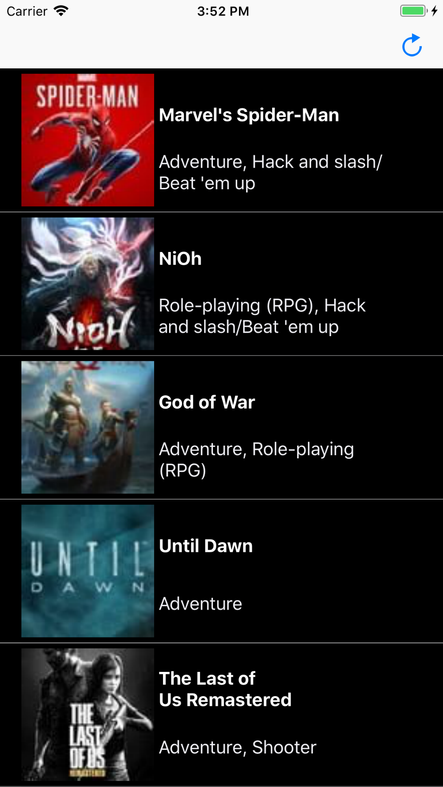

Name:

Video Games

OverView: 

The app displays the Top 50 video games for ps4 according to the popularity of the game provided by igdb.

When user select a game it shows a summary of gameplay, rating and genre

ScreenShots:

home screen where the list of games displayed

details of the games selected

Technical Details:
1. Libraries:

1.1 Swift Standard Library

1.2 Foundation

1.3 UIKit
1.4 CoreData

2.System Requirements:

2.1. min macOS to run:  iOS 10.13.2

2.2. Xcode version: 9.4.1

2.3. Swift Vresion: 4

2.4. Internet Connection to download for the first time running the app 
